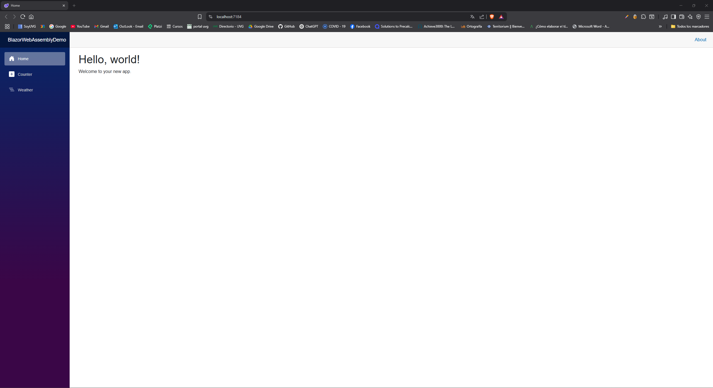

# Preparar el entorno para trabajar con Blazor

Para desarrollar con Blazor, el primer paso es instalar **Visual Studio 2022 Community**, el entorno de desarrollo gratuito de Microsoft. Durante la instalación se deben seleccionar ciertas características importantes.

## Pasos de instalación

1. **Descargar e instalar Visual Studio 2022 Community** desde el sitio oficial de Microsoft.
2. Al ejecutar el instalador, se te pedirá seleccionar las cargas de trabajo (**workloads**) necesarias. Para trabajar con Blazor, selecciona:

   * **ASP.NET and web development**
3. También puedes instalar otros frameworks o componentes adicionales según lo necesites, de forma individual.
4. En la pestaña **Language Pack**, puedes descargar paquetes de idioma si no deseas usar el idioma predeterminado.

Durante o después de la instalación, se te puede pedir que inicies sesión con una cuenta de Microsoft (opcional).

## Crear tu primer proyecto Blazor

1. Abre **Visual Studio 2022**.
2. Selecciona **Crear un nuevo proyecto**.
3. En el buscador, escribe **"Blazor"**. Verás dos plantillas principales:

   * **Blazor WebAssembly App**
   * **Blazor Server App**
4. Selecciona **Blazor WebAssembly App** para crear una aplicación que se ejecuta en el navegador.
5. Asigna un nombre y una ruta al proyecto (por ejemplo: `BlazorWebAssembly`) y haz clic en **Siguiente**.
6. En la siguiente pantalla podrás configurar detalles como:

   * Versión del framework .NET
   * Soporte para HTTPS
   * Configuración de autenticación (puede dejarse sin cambios)
7. Haz clic en **Crear**.

## Ejecución y vista previa

* Visual Studio generará un proyecto con múltiples componentes ya estructurados.
* Si aparece una advertencia solicitando permiso para abrir un navegador web, selecciona **"Sí"**.
* Visual Studio compilará el proyecto y abrirá una pestaña en el navegador (por ejemplo, `https://localhost:7184/`).

## Contenido inicial del proyecto

Dentro del navegador, verás una aplicación de ejemplo con las siguientes páginas:

* **Home**: Página de inicio con un mensaje de bienvenida.
* **Counter**: Página con un botón que incrementa un contador.
* **Fetch Data**: Página que simula la obtención de datos meteorológicos.

