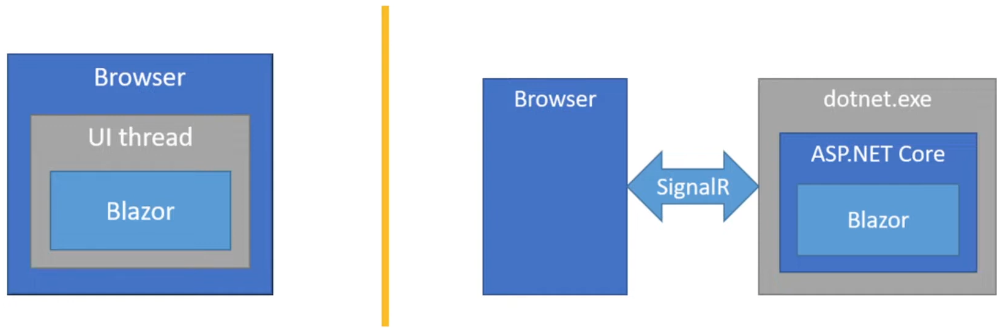

# Modelos de alojamiento de Blazor (Blazor Hosting Models)

Blazor ofrece dos formas principales de ejecutar aplicaciones web, conocidas como **modelos de alojamiento**:

- **Blazor WebAssembly (lado del cliente)**: la aplicación se ejecuta directamente en el navegador, usando un entorno de ejecución .NET basado en WebAssembly.
- **Blazor Server (lado del servidor)**: la aplicación se ejecuta en el servidor, usando ASP.NET Core. El navegador actúa como cliente, comunicándose mediante SignalR en tiempo real.

A pesar de que la ubicación de ejecución es diferente, **los componentes Blazor son los mismos** en ambos modelos: se desarrollan con **C#**, **HTML** y **CSS**, y se organizan en componentes reutilizables.

## ¿Qué es WebAssembly (WASM)?

WebAssembly es un estándar abierto creado por un esfuerzo conjunto entre **W3C**, **Google**, **Apple**, **Mozilla** y **Microsoft**, con el objetivo de permitir que los navegadores ejecuten **código binario a nivel casi nativo**, **sin necesidad de plugins** como Flash o Silverlight.

### Origen

- Antes de WebAssembly, JavaScript (creado en 1995 por Brendan Eich) era el único lenguaje soportado por los navegadores para lógica del cliente.
- Con el tiempo, surgieron problemas de rendimiento y seguridad.
- Soluciones como Flash o Silverlight requerían complementos externos, lo que afectaba la experiencia del usuario.
- WebAssembly (WASM) surgió como respuesta a esto, brindando **rendimiento nativo, sin plugins** y con soporte para múltiples lenguajes.

### Características de WASM

- Es un **formato de código binario** que puede ejecutarse en navegadores modernos.
- Lenguajes como **C, C++, C#, Go, Rust, Python**, entre otros, pueden compilarse a WebAssembly.
- En el caso de Blazor, **el runtime de .NET (dotnet.wasm)** se ejecuta dentro del navegador junto con la aplicación.

## ¿Qué es un `.dll`?

Un archivo **`.dll` (Dynamic-Link Library)** es un archivo de biblioteca dinámica usado en aplicaciones de Windows y .NET. Contiene **código compilado** que puede ser reutilizado por múltiples programas.

En una aplicación Blazor WebAssembly, el código C# se compila en archivos `.dll` (bibliotecas), que luego son cargadas en el navegador junto con el runtime de .NET para ser ejecutadas en el entorno WebAssembly.

## Blazor WebAssembly: ventajas y desventajas

### Ventajas

- Todo se ejecuta en el navegador: HTML, CSS, C# (compilado como DLL), y el runtime de .NET (dotnet.wasm).
- **No requiere conexión a internet** después de la primera carga.
- Código completamente del lado del cliente: ideal para aplicaciones que no dependen mucho del servidor.
- Permite reutilizar el mismo lenguaje en cliente y servidor (**C#**).

### Desventajas

- El tamaño de descarga inicial es alto (runtime .NET, archivos DLL, librerías, etc.).
- El rendimiento depende del navegador y del dispositivo del usuario.
- **Limitado por las capacidades del navegador** y las APIs web disponibles.
- **No es seguro manejar contraseñas o lógica crítica** solo desde el cliente, ya que todo el código se puede inspeccionar.
- Navegadores antiguos no soportan WebAssembly.

## Blazor Server

En este modelo, **la aplicación se ejecuta completamente en el servidor**. A diferencia de Blazor WebAssembly, el navegador no descarga ni ejecuta componentes de .NET ni el runtime; solo actúa como una interfaz gráfica ligera.

La comunicación entre el navegador y el servidor se realiza en tiempo real mediante **SignalR**, una tecnología que utiliza **WebSockets** (cuando están disponibles) o tecnologías alternativas para mantener una conexión activa.

### Características clave

- **Cliente ligero**: se descarga solo HTML, CSS y un pequeño script de SignalR.
- **Ejecución centralizada**: todo el código C# se ejecuta en el servidor, usando el **framework completo de ASP.NET Core**.
- **Acceso a recursos del servidor**: como bases de datos, archivos y servicios protegidos.
- **No depende de WebAssembly**: por lo tanto, es compatible con **navegadores más antiguos**.

### Ventajas

- **Tamaño de descarga reducido**: la aplicación carga rápido incluso con conexiones lentas.
- **Acceso total a ASP.NET Core**: permite usar todo el ecosistema del servidor, incluyendo servicios y middleware.
- **Mayor seguridad**: como el código y las credenciales sensibles no llegan al cliente, se pueden almacenar llaves, tokens y datos privados en el servidor.
- **Compatible con más navegadores**: ideal para entornos corporativos con software desactualizado.

### Desventajas

- **Requiere conexión constante a internet**: no funciona en modo offline.
- **Depende de un servidor ASP.NET Core**: es obligatorio tener un backend disponible para alojar la app.
- **Ligera latencia en las interacciones**: debido a la comunicación continua con el servidor.

  > *Nota: no significa que sea lento, pero puede ser menos ágil que Blazor WebAssembly en ciertas operaciones.*
